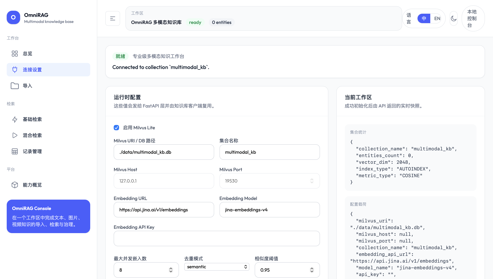
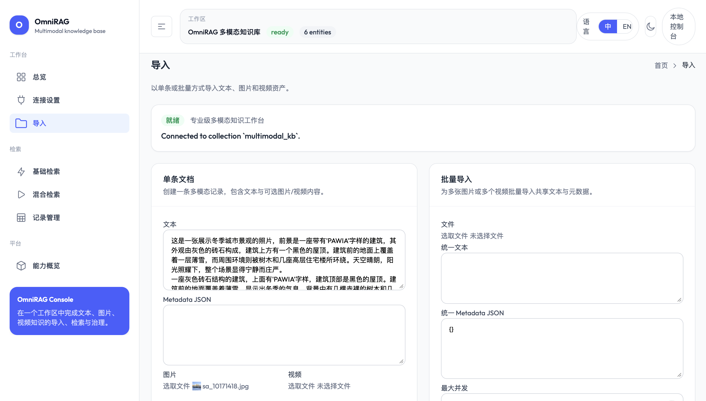
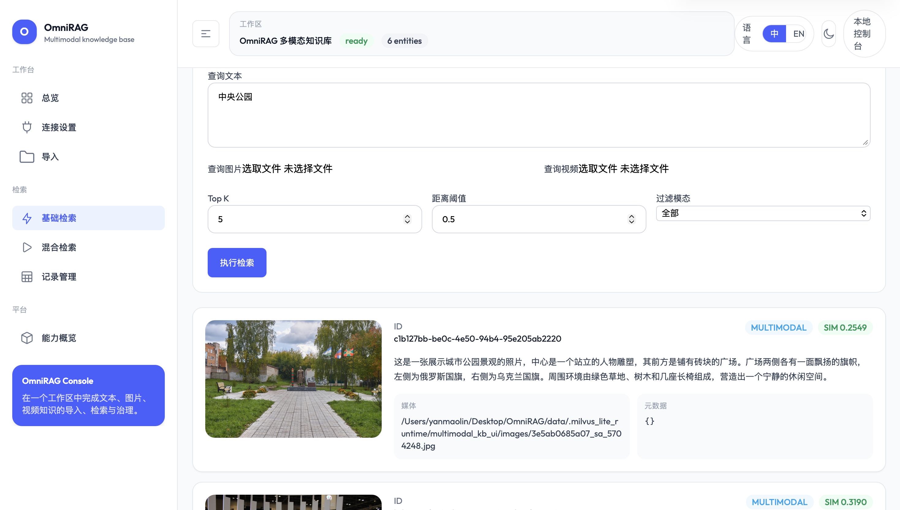

# OmniRAG

[English](./README.md) | [简体中文](./README.zh-CN.md)

OmniRAG is a professional multimodal retrieval workspace for building, operating, and evaluating knowledge bases over text, images, and video.

It combines a modern web console, a Python API layer, and a Milvus-backed retrieval engine into a local-first system for multimodal ingestion, semantic search, hybrid search, and record management.


## Quick Start

### 1. Clone the repository

```bash
git clone https://github.com/YMM19212/OmniRAG.git
cd OmniRAG
```

### 2. Install Python dependencies

```bash
pip install -r requirements.txt
```

### 3. Install frontend dependencies

```bash
cd dashboard
npm install
cd ..
```

### 4. Create a `.env` file

```bash
cp .env.example .env
```

Common options:

- Docker Milvus: keep `OMNIRAG_MILVUS_URI=` empty and use `OMNIRAG_MILVUS_HOST` / `OMNIRAG_MILVUS_PORT`
- Milvus Lite: set `OMNIRAG_MILVUS_URI=./data/multimodal_kb.db`
- Jina or compatible embedding service: set `OMNIRAG_EMBEDDING_API_URL`, `OMNIRAG_EMBEDDING_MODEL_NAME`, and `OMNIRAG_EMBEDDING_API_KEY`

`JINA_API_KEY` is still supported as a fallback for compatibility.

### 5. Start Milvus if you use Docker mode

Recommended for remote / standalone Milvus:

```bash
cd infra/milvus
docker compose up -d
cd ../..
```

Milvus will be exposed on:

- gRPC: `127.0.0.1:19530`
- health/admin: `127.0.0.1:9091`

If you use Milvus Lite through `OMNIRAG_MILVUS_URI`, skip this step.

### 6. Start the API

```bash
uvicorn api_server:app --host 127.0.0.1 --port 8000 --reload
```

### 7. Start the frontend

```bash
cd dashboard
npm run dev
```

Open:

- Frontend: `http://127.0.0.1:5173`
- API: `http://127.0.0.1:8000`
- Health check: `http://127.0.0.1:8000/api/health`

## Interface Overview

### Homepage

The homepage summarizes system status, collection statistics, and recently accessed records so you can quickly confirm whether the workspace is connected and ready.


### Configuration

The configuration page is used to initialize the knowledge base, switch between Milvus Lite and standalone Milvus, and adjust embedding and deduplication settings.



### Ingestion

The ingestion page supports single-item and batch imports for text, images, and videos, with options such as duplicate skipping and thumbnail extraction.



### Retrieval

The retrieval page supports text, image, and video queries, plus modality filters and similarity thresholds for semantic search and result inspection.



## Why OmniRAG

Most multimodal RAG demos stop at a notebook or a simple chat interface. OmniRAG is designed as an operational surface:

- A professional dashboard for configuration, ingestion, retrieval, and record governance
- A dedicated FastAPI service layer instead of UI-bound runtime logic
- Support for text-only, image-plus-text, and video-plus-text indexing workflows
- Both semantic search and hybrid cross-modal retrieval
- Milvus-backed storage with duplicate detection support

## Features

- Professional web console
- English and Chinese language toggle
- Homepage for runtime overview and collection health
- Single-item and batch ingestion
- Text, image, and video retrieval workflows
- Hybrid search across modalities
- Runtime configuration and status inspection
- Collection statistics and result management
- Selection-based record deletion
- Streamlit fallback retained for compatibility

## Architecture

```text
OmniRAG
|- dashboard/          React + Vite + Tailwind frontend
|- api_server.py       FastAPI service layer
|- multimodal_kb/      Core multimodal RAG logic
|- ui_backend.py       Sync runtime bridge for UI/API
|- app.py              Legacy Streamlit interface
`- infra/milvus/       Docker Compose for Milvus standalone
```

### Core stack

- Frontend: React 19, TypeScript, Tailwind CSS, Vite
- Backend: FastAPI
- Vector store: Milvus
- Embeddings: Jina `jina-embeddings-v4`
- Media processing: OpenCV, Pillow, NumPy

## Project Structure

```text
dashboard/
multimodal_kb/
infra/milvus/
api_server.py
ui_backend.py
app.py
requirements.txt
```

## API Overview

### Knowledge base lifecycle

- `POST /api/kb/initialize`
- `GET /api/kb/status`
- `GET /api/kb/config`
- `GET /api/kb/stats`

### Document operations

- `POST /api/kb/documents`
- `POST /api/kb/documents/batch`
- `DELETE /api/kb/documents`

### Retrieval

- `POST /api/kb/search`
- `POST /api/kb/search/hybrid`

### Health

- `GET /api/health`

## Running Modes

### Recommended mode

Use the following combination for the most stable setup:

- React dashboard
- FastAPI backend
- Docker Milvus standalone configured through `.env`

### Streamlit fallback

The original Streamlit interface is still available for compatibility and debugging:

```bash
streamlit run app.py --server.address 127.0.0.1 --server.port 10188
```

## Configuration Notes

### Environment-based configuration

OmniRAG now loads runtime defaults from the project-root `.env` file. The backend, Streamlit UI, and dashboard initialization form all read from the same configuration source.

Create the file with:

```bash
cp .env.example .env
```

Key variables:

- `OMNIRAG_EMBEDDING_API_URL`
- `OMNIRAG_EMBEDDING_MODEL_NAME`
- `OMNIRAG_EMBEDDING_API_KEY` or `JINA_API_KEY`
- `OMNIRAG_MILVUS_URI`
- `OMNIRAG_MILVUS_HOST`
- `OMNIRAG_MILVUS_PORT`
- `OMNIRAG_COLLECTION_NAME`
- `OMNIRAG_VIDEO_SAMPLE_FRAMES`
- `OMNIRAG_MAX_CONCURRENT_EMBEDS`
- `OMNIRAG_ENABLE_DEDUPLICATION`
- `OMNIRAG_DEDUP_MODE`

### Milvus Lite vs Docker Milvus

OmniRAG supports both Milvus Lite and remote Milvus.

Use Milvus Lite:

- `OMNIRAG_MILVUS_URI=./data/multimodal_kb.db`

Use Docker / remote Milvus:

- `OMNIRAG_MILVUS_URI=`
- `OMNIRAG_MILVUS_HOST=127.0.0.1`
- `OMNIRAG_MILVUS_PORT=19530`

### Default collection

```text
multimodal_kb
```

### Default embedding model

```text
jina-embeddings-v4
```

## Development

### Frontend

```bash
cd dashboard
npm run dev
```

The Vite dev server proxies `/api` to `http://127.0.0.1:8000`.

### Production build

```bash
cd dashboard
npm run build
```

## Known Limitations

- Embedding requests depend on a valid external Jina API key
- Milvus Lite is not equally available across all operating systems and Python versions
- The current deployment flow is optimized for local development rather than packaged production release

## Roadmap

- Stronger secret handling and config protection
- Better upload progress and long-running task feedback
- Richer collection management
- Evaluation tooling for retrieval quality
- Better multimodal result previews
- Optional single-service deployment mode

## License

This project is released under the [MIT License](./LICENSE).
